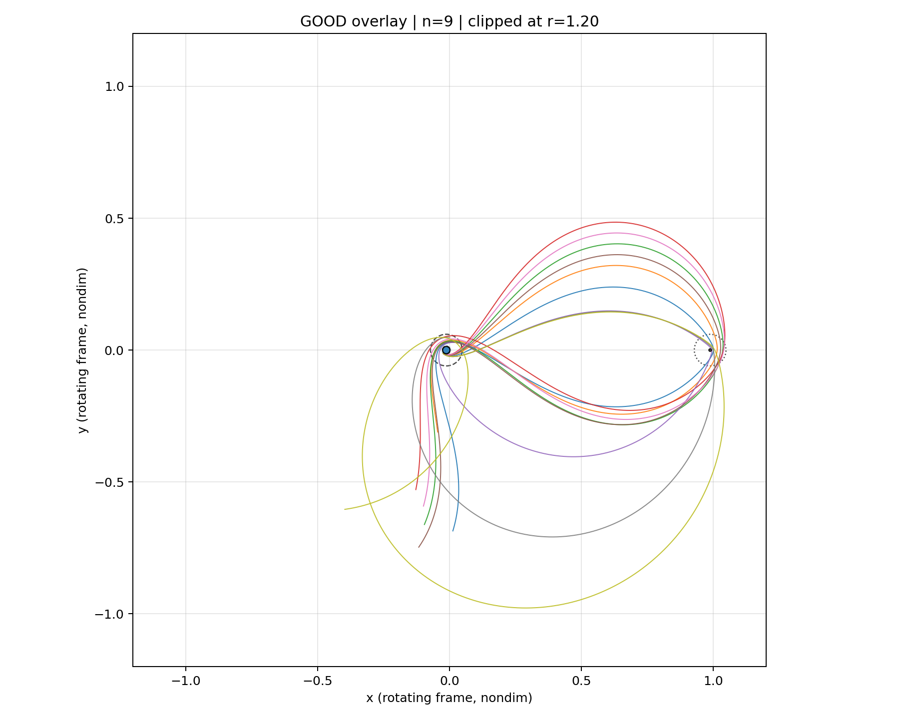

# RL-CR3BP-Free-Return-Thesis

**Reinforcement Learning for Spacecraft Trajectory Generation in the Earth–Moon System with Dynamical Perturbations**

Degree Project in Space Technology · Master's Programme in Aerospace Engineering, 120 credits
KTH Royal Institute of Technology, Stockholm, Sweden

William Bernholm · Supervisor: Gunnar Tibert · Examiner: Huina Mao · July 2026


---

## Overview

Free-return trajectories have been used since the Apollo era to reach a close lunar approach and use the Moon's gravity to safely return to Earth without additional impulses. Designing these trajectories requires solving the Circular Restricted Three-Body Problem (CR3BP), a highly nonlinear and sensitive dynamical system with no closed-form solution.

This thesis investigates the generation and correction of Earth–Moon free-return trajectories using deep reinforcement learning, specifically **Proximal Policy Optimization with Long Short-Term Memory (PPO-LSTM)**. Two agents are trained:

- **PPO-TLI** — learns the Trans-Lunar Injection (TLI) burn from a Low Earth Orbit parking orbit, generating a ballistic free-return trajectory via one or more short burns.
- **PPO-MCC** — learns Mid-Course Correction (MCC) burns that recover or refine a near free-return trajectory roughly 30 minutes after TLI.

Both agents act in a semi-Markov Decision Process: each action is a bounded 2D Δv impulse *and* a variable drift time τ before the next decision. This required extending the standard recurrent PPO formulation with a time-aware rollout buffer, time-aware GAE, and a tanh-squashed Gaussian policy for bounded continuous actions.

The results show that an RL agent can both discover and correct free-return trajectories, though performance is strongly limited by the sensitivity of the Earth–Moon system: small early deviations amplify into large downstream errors, which the agent frequently struggles to compensate for. A three-stage curriculum — gradually adjusting entropy, reward weights, and penalty magnitudes — was found necessary to reach stable, useful behavior.

## Key Results

| PPO-TLI: free-return rate during training | PPO-MCC: mean evaluation reward |
|---|---|
|  |  |


*Example of a successfully corrected near free-return trajectory (MCC).*

Highlights from the thesis:

- The PPO-MCC agent recovered a near free-return trajectory (library index 65) using a total correction of **≈45 m/s**, compared to a **≈23.5 m/s** single-impulse optimum found via differential evolution — a useful reference for how close the learned policy gets to the classical optimal correction.
- Under Monte Carlo perturbation testing (position σ up to 2000 m, velocity σ up to 10 m/s), the trained policies were compared against simply replaying the nominal open-loop action:

  | Agent | Nominal | Position only | Velocity only | Position + velocity |
  |---|---|---|---|---|
  | PPO-TLI (adaptive) | 100.0% | 28.2% | 5.8% | 3.4% |
  | PPO-MCC (adaptive) | 100.0% | 99.2% | 21.2% | 22.6% |

  PPO-MCC's closed-loop correction meaningfully outperforms open-loop replay under position perturbations, while PPO-TLI's success rate collapses quickly — reflecting the much higher sensitivity of the TLI phase of the mission.

The full derivation, reward design, curriculum tables, and discussion are in the [thesis report](#citation).

## Method Summary

- **Environment (`cr3bp_env_v4.py`)** — planar Earth–Moon CR3BP dynamics, nondimensionalized, propagated with an adaptive-timestep RK4 integrator that automatically refines near Earth/Moon close approaches. Supports both PPO-TLI (spawn in LEO at a given phase angle) and PPO-MCC (spawn from a precomputed post-TLI handoff state) training regimes, plus a configurable terminal + dense reward function.
- **Custom RL backend (`custom_rl/`)** — extends Stable-Baselines3's recurrent PPO to support the variable-duration (SMDP) action structure used here:
  - `TimeAwareRecurrentPPOv2` / `TimeAwareRecurrentRolloutBuffer` — discounting and advantage estimation account for the actual elapsed drift time between decisions, not just step count.
  - `SquashedMlpLstmPolicy` — a recurrent Gaussian policy with a tanh-squashed action distribution, giving correctly bounded continuous actions with consistent log-probabilities.
- **Curriculum (`curriculum_ppoa.py`, `curriculum_ppob.py`)** — three-stage curricula for PPO-TLI and PPO-MCC respectively, gradually shifting entropy coefficients, Δv penalties, and crash/invalid-orbit penalties from exploration toward refinement.
- **Configuration (`config.py`)** — the single source of truth for run settings, reward weights, curriculum stage definitions, and environment parameters, shared by the environment, training script, and curriculum files.
- **Training/evaluation (`train_ppo_v4.py`)** — orchestrates training, periodic evaluation, checkpointing, and plot/report generation for both agents.

## Repository Structure

| Path | Contents |
|---|---|
| [`config.py`](config.py) | Central configuration: PPO hyperparameters, reward weights, curriculum stages, environment settings |
| [`cr3bp_env_v4.py`](cr3bp_env_v4.py) | The CR3BP free-return Gymnasium environment (dynamics, propagation, reward, termination) |
| [`custom_rl/`](custom_rl) | Custom time-aware recurrent PPO backend (SMDP rollout buffer, squashed recurrent policy) |
| [`curriculum_ppoa.py`](curriculum_ppoa.py) | PPO-TLI (PPO-A) curriculum stage definitions |
| [`curriculum_ppob.py`](curriculum_ppob.py) | PPO-MCC (PPO-B) curriculum stage definitions |
| [`train_ppo_v4.py`](train_ppo_v4.py) | Main training/evaluation entry point (interactive CLI) |
| [`cr3bp_plotting_v4.py`](cr3bp_plotting_v4.py) | Trajectory, training-curve, and diagnostic plotting utilities |
| [`Saved Policies/`](Saved%20Policies) | Trained model checkpoints (`.zip`), run configs, TensorBoard logs, and final training plots for the runs discussed in the thesis |
| [`All configs used/`](All%20configs%20used) | Exported run-configuration tables (TLI/MCC) referenced in the thesis appendix |
| [`rough_scenario_classification/`](rough_scenario_classification) | Handoff-state scenario library used to initialize PPO-MCC training, plus classification data/overlays |
| [`extra_scrips/`](extra_scrips) | Supporting analysis scripts: differential-evolution baselines, reward-landscape heatmaps, sensitivity/perturbation replay, TLI→MCC handoff tooling |

## Setup

```bash
git clone https://github.com/WilliamBernholm/RL-CR3BP-Free-Return-Thesis.git
cd RL-CR3BP-Free-Return-Thesis
python -m venv .venv
.venv\Scripts\activate        # on Windows
pip install -r requirements.txt
```

Developed and tested with Python 3.10, PyTorch, Stable-Baselines3 + sb3-contrib, and Gymnasium. See [`requirements.txt`](requirements.txt) for exact pinned versions.

## Usage

Training is driven by editing the curriculum/config files *before* launching the script — there are no command-line flags.

### 1. Configure the run

- [`config.py`](config.py) — base environment settings, PPO hyperparameters, and the default reward weights/thresholds.
- [`curriculum_ppoa.py`](curriculum_ppoa.py) / [`curriculum_ppob.py`](curriculum_ppob.py) — per-stage overrides (`RewardWeights`, entropy coefficient, timesteps, etc.) for the PPO-TLI and PPO-MCC curricula respectively. This is where you tune the reward shaping between exploration and refinement stages.

### 2. Select the PPO-MCC scenario (PPO-MCC only)

PPO-MCC starts from a precomputed post-TLI handoff state instead of LEO, so before training PPO-MCC you must pick which scenario library file and which case inside it to use. This is set at the top of `build_curriculum_ppob()` in [`curriculum_ppob.py`](curriculum_ppob.py):

```python
MAIN_LIB = str(
    Path("rough_scenario_classification")
    / "Lunar_inpact_30min_2026-05-23_15-57-28.npz"
)
MAIN_CASE_IDX = 0
```

Both are referenced later as `ppo_b_library_path=MAIN_LIB` and `ppo_b_fixed_index=MAIN_CASE_IDX` in each curriculum stage. Any `.npz` scenario library under [`rough_scenario_classification/`](rough_scenario_classification) can be used here. The library/index combination used for most of the PPO-MCC results in the thesis was:

```python
MAIN_LIB = str(Path("rough_scenario_classification") / "ppob_handoff_states_30min.npz")
MAIN_CASE_IDX = 65
```

### 3. Run

```bash
python train_ppo_v4.py
```

```
[1] Train new policy PPO_TLI (PPO_A)
[2] Train new policy PPO_MCC (PPO_B)
[3] Load existing policy and run one eval rollout + plot
[4] Launch timelapse animator
[5] Continue training existing policy
[6] Launch manual override env
[7] Use pre selected checkpoint (Ubuntu/server)
[8] Batch evaluate saved policy
```

- **Train from scratch**: option `1` (PPO-TLI) or `2` (PPO-MCC), using whatever is currently set in `config.py`/the curriculum files.
- **Evaluate a trained policy**: option `3`, then select one of the `.zip` checkpoints under [`Saved Policies/`](Saved%20Policies).
- **Resume training**: option `5` to continue any saved checkpoint under its original or a new curriculum.
- **Options `4`–`8`** were early-development/debug tooling (timelapse animator, manual override env, preselected-checkpoint launcher, batch evaluation) and were never finished — they may not work correctly. Only options `1`, `2`, `3`, and `5` are needed to reproduce the thesis workflow.

> **Runtime**: episode propagation uses adaptive RK4 with region-based timestep refinement near the Earth/Moon, so wall-clock training time depends heavily on how often the trajectory enters a fine-timestep region. A full curriculum (500k–800k steps) can take a long time depending on hardware; the propagation loop is a known area that could be optimized further (e.g. coarser adaptive stepping, vectorization).
>
> **Storage**: a full run under `Saved Policies/` can reach up to ~2 GB depending on run length, mostly from periodic checkpointing and plot generation (see below). This level of logging was kept intentionally for thesis-level analysis but is more than a casual run needs — reduce checkpoint/plot frequency in `train_ppo_v4.py` if disk space is a concern.

### What gets generated during training

Each run creates a timestamped folder under `Saved Policies/` that fills up as training progresses:

| File/folder | Contents |
|---|---|
| `run_config.txt` | Full snapshot of the config/reward/curriculum/PPO settings used for the run — the reference for reproducing or comparing runs |
| `*.zip` | Model checkpoints, periodically saved and milestone-tagged with their metrics in the filename (e.g. mean reward, success rate) so the best checkpoints can be identified without reloading every one |
| `tb/` | TensorBoard event logs for the run |
| `final_training_plots/` | Generated at the end of training: `final_ppo_metrics.png` (KL divergence, clip fraction, value loss, explained variance, entropy — PPO training diagnostics), `final_mean_eval_reward.png`, `final_mean_eval_dv.png`, `final_free_return_rates.png`, and `last_eval_snapshot/` (trajectory plots from the final evaluation rollout) |
| `resume_info.txt` | Bookkeeping needed to resume training from this checkpoint under the same or a different curriculum |

These plots and logs are the main tool for judging whether a run actually learned useful behavior — cumulative reward alone can be misleading (see the thesis discussion on reward exploitation), so `final_ppo_metrics.png` and `final_free_return_rates.png` in particular are worth checking together.

PPO-MCC training draws its initial post-TLI states from the scenario library selected in step 2 above, under [`rough_scenario_classification/`](rough_scenario_classification).

## Citation

If you reference this work, please cite:

```
W. Bernholm, "Reinforcement Learning for Spacecraft Trajectory Generation in the
Earth–Moon System with Dynamical Perturbations," Degree Project in Space Technology,
KTH Royal Institute of Technology, Stockholm, Sweden, 2026.
```

## License

This project is licensed under the MIT License — see [LICENSE](LICENSE) for details.

## Acknowledgments

Supervised by Gunnar Tibert; examined by Huina Mao, KTH Royal Institute of Technology.
